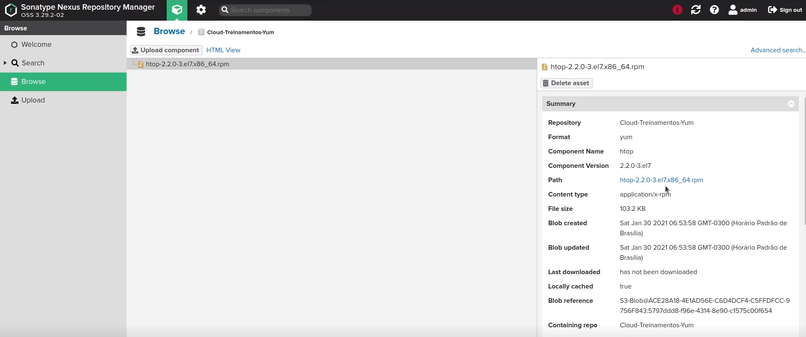

# MODULO NEXUS

Nesse modulo iniciei uma instancia utilizando o serviço EC2 da AWS.
Usei um script de inicialização (userdata.sh) para assim que provisionar a instancia, e o Nexus e suas dependencias já estarem instalados e funcionando. 

Configuramos um backut S3 para gerenciar o armazenamento e iniciamos um gerenciamento do repositorio yum como teste. 
    
https://gitlab.com/rafaelrsr/formacaodevops/-/blob/develop/modulo-nexus/userdata.sh

# DASHBOARD CRIADO

# OBSERVAÇÕES

Uma excelente ferramenta para distribuir e gerenciar repositorios.