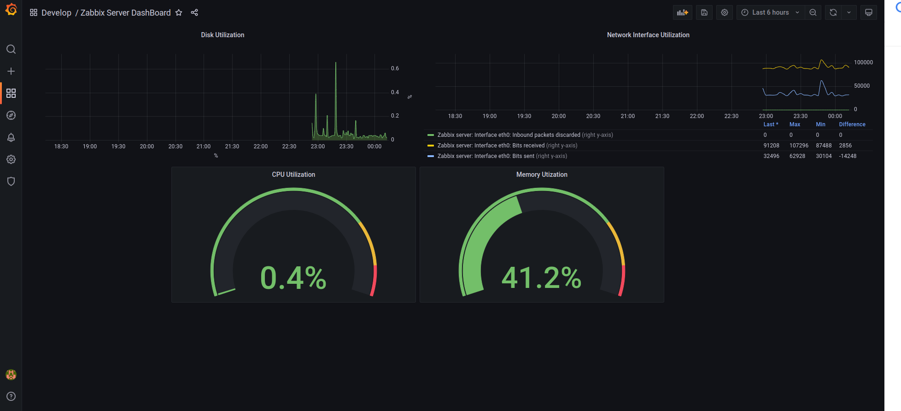

# MODULO GRAFANA

Nesse modulo iniciei uma instancia utilizando o serviço EC2 da AWS.
Usei um script de inicialização (userdata.sh) para assim que provisionar a instancia, o Grafana já estar instalado e funcionando. 
    
[Script Utilizado](https://github.com/rafael-rsr/formacao-devops/blob/main/grafana/userdata.sh)

# DASHBOARD CRIADO

# OBSERVAÇÕES

Uma excelente ferramenta de monitoramento. Com a costumização de dashboard de acordo com o nosso gosto, fica mais facil o entedimento dos gráficos do ambiente.

