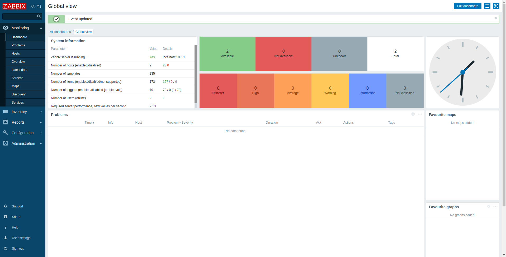
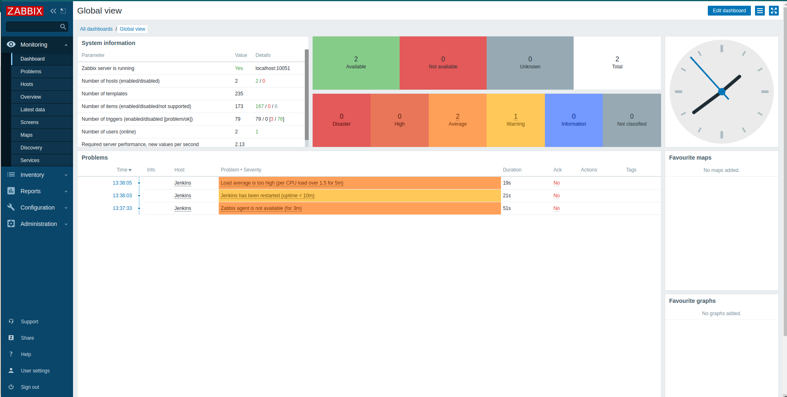
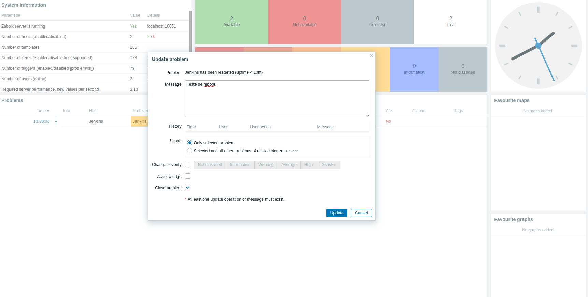

# ZABBIX

Nesse modulo instalei um Zabbix Server. 
Para realizar testes, configurei o monitoramento da minha instancia Jenkins Server com o Zabbix agent:

### PASSO 1

  Instalção do Zabbix Server realizado atraves de uma instancia EC2 na AWS com um banco de dados mySQL usando o serviço RDS também da AWS.

  [Script Zabbix Server](https://github.com/rafael-rsr/formacao-devops/blob/main/zabbix/Install_zabbix_server.sh)
  

### PASSO 2

  Instalação do Zabbix Agent na instancia EC2 do projeto Jenkins Server (https://gitlab.com/rafaelrsr/desafiojenkins):

  [Script Zabbix Agent](https://github.com/rafael-rsr/formacao-devops/blob/main/zabbix/install_zabbix_agent.sh)

### PASSO 3

  Cadastro do HOST Jenkins dentro da plataforma do Zabbix usando um template pronto (OS Linux by Zabbix agent).

# IMAGENS

  ### 1. Zabbix Server iniciado e com host cadastrado

  ### 2. Zabbix Server com alerta da instancia Jenkins Server

  ### 3. Comentando e tratando o alerta

# OBSERVAÇÕES

  Como primeiro contato com o Zabbix, foi possivel identificar que podemos monitorar muita coisa dentro dessa ferramenta Open Source poderosa.
  Nesse primeiro momento fiz um monitoramento de reboot da instancia.
  Sei que ainda tem muito o que aprimorar nesse projeto, porém com o conceito da ferramenta fica mais fácil de estuar a documentação.

# MELHORIAS PREVISTAS

  - Instalação de Zabbix Proxy
  - Integração de notificações via e-mail e/ou mensagem instantânea

